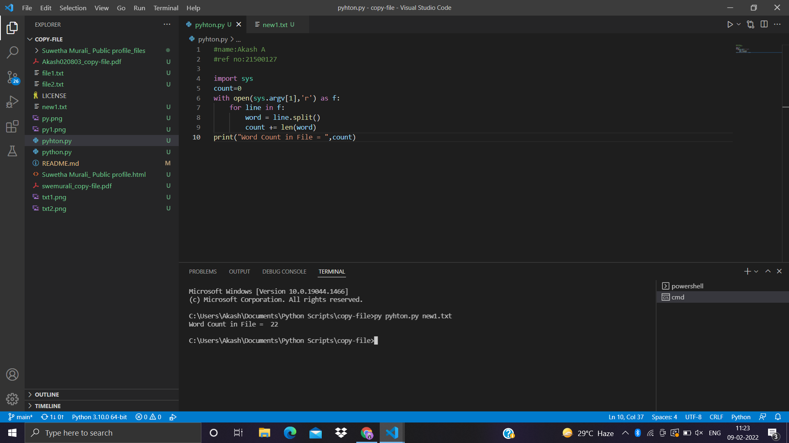
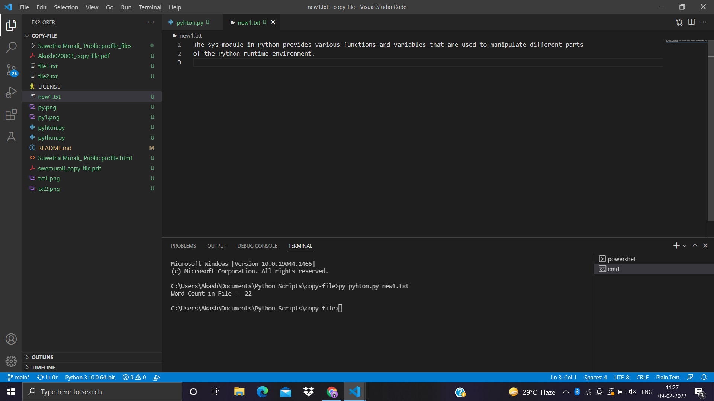

# command-line-arguments-to-count-word
## AIM:
To write a python program for getting the word count from the contents of a file using command line arguments.
## EQUIPEMENT'S REQUIRED: 
PC
Anaconda - Python 3.7
## ALGORITHM: 
### Step 1:

### Step 2: 
 
### Step 3: 

### Step 4:  

### Step 5: 

### Step 6: 

## PROGRAM:
```
#name:Akash A
#ref no:21500127

import sys
count=0
with open(sys.argv[1],'r') as f:
    for line in f:
        word = line.split()
        count += len(word)
print("Word Count in File = ",count)
```

### OUTPUT:

## Program:

## Text File:

## RESULT:
Thus the program is written to find the word count from the contents of a file using command line arguments.
